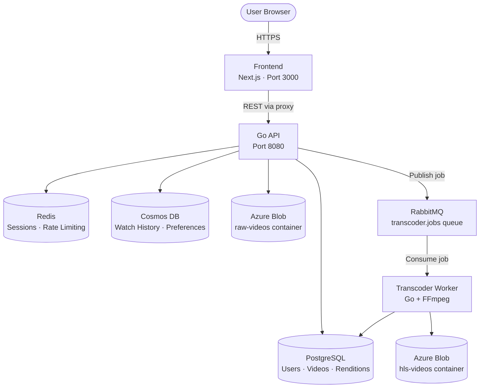
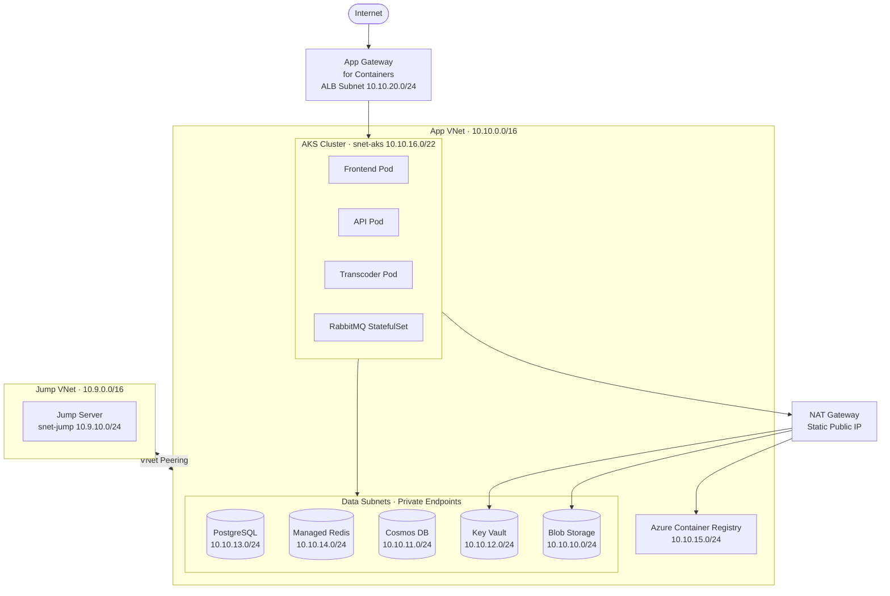

# StreamForge

A cloud-native video streaming platform deployed on **Azure Kubernetes Service**, built to demonstrate production-grade DevOps practices — Infrastructure as Code, GitOps CI/CD, private networking, workload identity, and HLS adaptive bitrate streaming.

---

## Architecture

### Application Flow



### Azure Infrastructure



---

## Technology Stack

| Layer | Technology | Deployment |
|---|---|---|
| Frontend | Next.js 14 + TypeScript | AKS Pod |
| API | Go 1.24 (chi router) | AKS Pod |
| Transcoder | Go 1.24 + FFmpeg 8.0 | AKS Pod |
| Message Queue | RabbitMQ 4.2 | AKS StatefulSet |
| Relational DB | PostgreSQL 17 | Azure Flexible Server |
| Document DB | MongoDB API | Azure Cosmos DB |
| Cache | Redis | Azure Managed Redis |
| Object Storage | Blob (HNS enabled) | Azure Storage Account |
| Secrets | Key Vault + CSI Driver | Azure Key Vault |
| Container Registry | GHCR → ACR | Azure Container Registry |
| IaC | Terraform (azurerm 4.x) | GitHub Actions |
| CI/CD | GitHub Actions + OIDC | GitHub-hosted runners |
| Networking | Calico CNI overlay | AKS network profile |
| Observability | Prometheus + Grafana | Azure Managed Grafana (planned) |

---

## CI/CD Pipelines

All pipelines use **OIDC federated identity** — no stored Azure credentials.

| Pipeline | Trigger | What it does |
|---|---|---|
| `backend-api.yml` | Push/PR to `backend/api/**` | Build → Docker build (PR) → Push ACR (main) |
| `backend-transcoder.yml` | Push/PR to `backend/transcoder/**` | Build → Docker build (PR) → Push ACR (main) |
| `frontend-nextjs.yml` | Push/PR to `frontend/**` | Build → Docker build (PR) → Push ACR (main) |
| `infra-provision.yml` | PR to `terraform/**` | Terraform fmt → init → validate → plan → PR comment | Apply on `main` branch only on push event |

### OIDC Setup

Two federated credentials are configured on the service principal:

```
repo:SudheerKumarP0357/streamforge:pull_request  → plan jobs
repo:SudheerKumarP0357/streamforge:ref:refs/heads/main  → apply jobs
```

Required GitHub secrets: `ARM_CLIENT_ID`, `ARM_SUBSCRIPTION_ID`, `ARM_TENANT_ID`, `BACKEND_RESOURCE_GROUP_NAME`, `BACKEND_STORAGE_ACCOUNT_NAME`, `BACKEND_STORAGE_CONTAINER_NAME`, `BACKEND_STATE_KEY`

---

## Infrastructure (Terraform)

State is stored in Azure Blob Storage with backend config injected at runtime — no credentials in code.

```
terraform/
├── modules/
│   └── private-endpoint/   # reusable private endpoint + DNS zone + VNet links
├── aks.tf                  # AKS cluster, node pools, workload identity, ALB identity
├── nat.tf                  # NAT Gateway + public IP + subnet association
├── network.tf              # VNets + VNet peering (app ↔ jump)
├── subnets.tf              # All subnets with delegations
├── keyvault.tf             # Key Vault + RBAC assignments
├── az-storage-acc.tf       # Storage account + containers + CORS + private endpoint
├── postgres.tf             # PostgreSQL Flexible Server + private DNS
├── redis.tf                # Managed Redis + private endpoint
├── cosmos.tf               # Cosmos DB (Mongo API) + private endpoint
├── acr.tf                  # Container Registry + AcrPull role for AKS kubelet
├── locals.tf               # Shared name prefix: {app}{env}{region}
├── variables.tf            # All variables with descriptions
├── outputs.tf              # Key resource names for pipeline consumption
└── terraform.tfvars        # Non-sensitive defaults (no secrets)
```

### Key design decisions

- **NAT Gateway** — all AKS pod egress routes through a static public IP, enabling IP-based firewall rules on Key Vault and Storage
- **Private endpoints** — all data services (Postgres, Redis, Cosmos, Key Vault, Blob, ACR) are private with DNS zones linked to both VNets
- **Workload Identity** — pods authenticate to Azure services via federated OIDC, no stored credentials in pods
- **Key Vault CSI Driver** — secrets mounted as files into pods with 2-minute rotation polling
- **Separate secrets pipeline** — Key Vault secret *values* are never managed by Terraform to keep them out of state

---

## Local Development

### Prerequisites

- Docker + Docker Compose
- Go 1.24
- Node 20+
- Azure Storage Account (with HNS enabled) for blob operations

### Start all services

```bash
cp .env.example .env        # fill in Azure storage credentials
docker compose up --build
```

Services available at:

```
Frontend   http://localhost:3000
API        http://localhost:8080
RabbitMQ   http://localhost:15672  (guest/guest)
```

### Environment variables

| Variable | Where set | Used by |
|---|---|---|
| `API_URL` | Docker runtime env | Frontend Server Components |
| `API_ENV` | Docker build arg | Frontend browser client |
| `AZURE_STORAGE_ACCOUNT_NAME` | `.env` | API + Transcoder |
| `AZURE_STORAGE_ACCOUNT_KEY` | `.env` | API + Transcoder |
| `JWT_SECRET` | `.env` | API |
| `RABBITMQ_URL` | Compose env | API + Transcoder |

> **Note:** `API_URL` is baked into the JS bundle at build time. All Server Component API calls use `API_URL` at runtime — this avoids `ECONNREFUSED` inside pods where `localhost` does not resolve to the API service.

---

## Kubernetes Deployment

### Namespace

All StreamForge workloads run in `streamforge-{env}` (e.g. `streamforge-prod`).

### Workload Identity

Each pod that accesses Azure services uses a Kubernetes service account annotated with the workload identity client ID:

```yaml
serviceAccountName: sf-workload-sa   # bound to sf-workload-uami via federated credential
```

The federated credential subject is: `system:serviceaccount:streamforge-prod:sf-workload-sa`

### Transcoder scaling

The transcoder processes one video at a time per pod (`prefetch=1` on RabbitMQ consumer). RabbitMQ guarantees each job is delivered to exactly one consumer — safe to run multiple replicas. Current replica count is constrained by subscription CPU quota.

FFmpeg is configured with `-threads 4` globally to prevent OOMKill — each rendition does not spin up its own thread pool.

### RabbitMQ heartbeat

Long FFmpeg jobs (2–5 min) can outlast the default RabbitMQ heartbeat. The AMQP URL includes `?heartbeat=180` and the consumer implements reconnection with backoff.

---

## Secrets Management

Secrets follow a two-layer pattern:

1. **Terraform** provisions the Key Vault shell (firewall, access policies, private endpoint) — no secret values
2. **Secrets pipeline** (manual trigger) temporarily whitelists the runner IP, pushes secret values via `az keyvault secret set`, then removes the whitelist entry

This keeps secret values out of Terraform state entirely.

---

## Networking & Security

| Control | Implementation |
|---|---|
| Cluster API server | Private — only reachable from Jump VNet via peering |
| Pod egress | NAT Gateway — static IP whitelisted on all private resources |
| Inbound traffic | App Gateway for Containers on dedicated ALB subnet |
| Pod-to-pod | Calico CNI overlay (10.244.0.0/16) |
| Cross-service auth | Workload Identity (OIDC) — no stored credentials in pods |
| Secret rotation | Key Vault CSI Driver — 2-minute polling interval |
| Node access | Jump server via VNet peering — SSH to nodes only from jump subnet |

### NSG rules (AKS subnet)

Inbound allows: VirtualNetwork, AzureLoadBalancer, pod CIDR (10.244.0.0/16), ALB subnet, jump subnet (SSH), API server (konnectivity on 9443, kubelet on 10250).

Outbound allows: VirtualNetwork, pod CIDR, AzureCloud (443, 8132 for konnectivity), DNS (53), Azure infra (168.63.129.16), IMDS (169.254.169.254), data subnets on service ports.

---

## Health Checks

| Service | Endpoint | Checks |
|---|---|---|
| API | `GET /healthz` | postgres, redis, rabbitmq, cosmos |
| Transcoder | Prometheus metrics on `:9090` | queue depth, pipeline status |
| Frontend | `GET /api/health` | upstream API reachability |

---

## Observability

Prometheus metrics are instrumented on the API (`/metrics`) and Transcoder (`:9090/metrics`). Azure Managed Grafana provisioning is planned — dashboards will cover:

- RabbitMQ queue depth and consumer count
- Transcoder pipeline duration per rendition
- API request rate, latency, error rate by endpoint
- AKS node CPU/memory utilisation